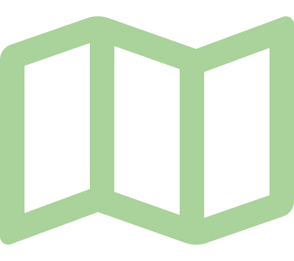

 

# Apache Baremaps (Incubating)

**Apache Baremaps** is a toolkit and a set of infrastructure components for creating, publishing, and operating online maps. It provides a data pipeline enabling developers to build maps with different data sources with live reload capabilities. It provides other services commonly used in online maps, such as location search and IP to location.

## 🔥 Live Demo

[https://demo.baremaps.com/](https://demo.baremaps.com/)

## 📖 How do I use Apache Baremaps?

You can find the official documentation at [https://baremaps.apache.org/](https://baremaps.apache.org/). The following pages showcase the main uses of Apache Baremaps.

- The [OpenStreetMap](https://baremaps.apache.org/examples/import-osm-into-postgis/) example is a good introduction to Baremaps, it shows how to produce high resolution vector tiles.
- The [NaturalEarth](https://baremaps.apache.org/examples/import-naturalearth-into-postgis/) example shows how to produce low resolution vector tiles.
- The [Contour](https://baremaps.apache.org/examples/import-contour-into-postgis/) example shows how to produce contour lines from a digital elevation model.
- The [IP to location](https://baremaps.apache.org/examples/ip-to-location/) example shows how to create and serve an IP to location service in a simple web application.
- The [Geocoding](https://baremaps.apache.org/examples/geocoding/) example shows how to create and serve a geocoding service in a simple web application.

## 👩‍💻 How do I contribute?

There are many places where you can contribute to Apache Baremaps such as the code, the documentation, the website or the examples.

The official documentation is located in a separate repository available here [https://github.com/apache/incubator-baremaps-site](https://github.com/apache/incubator-baremaps-site).

If you want to contribute to the code you can refer to the following developer guides available in the documentation.

- [Project structure](https://baremaps.apache.org/developer-manual/project-structure/)
- [How to build with Maven](https://baremaps.apache.org/developer-manual/how-to-build-with-maven/)
- [Set up in IntelliJ IDEA](https://baremaps.apache.org/developer-manual/setup-with-intellij/)
- [Geocoder](https://baremaps.apache.org/developer-manual/geocoder/)
- [IP to location](https://baremaps.apache.org/developer-manual/ip-to-location/)
- [Stylesheet](https://baremaps.apache.org/developer-manual/stylesheet/)

You can also contribute in the following ways.

- [Create an issue](https://github.com/apache/incubator-baremaps/issues): Report a bug or feature request
- [Join the mailing list](https://lists.apache.org/list.html?dev@baremaps.apache.org): Initiate or participate in project discussions on the mailing list
- [Write a post](https://medium.com/): Write a post to share your use cases and experiences with Apache Baremaps

Finally, check out [CONTRIBUTING](CONTRIBUTING.md) and [CODE_OF_CONDUCT](CODE_OF_CONDUCT.md).

## 📄 License

This project is licensed under Apache License 2.0 - see the [LICENSE](LICENSE) file for details.