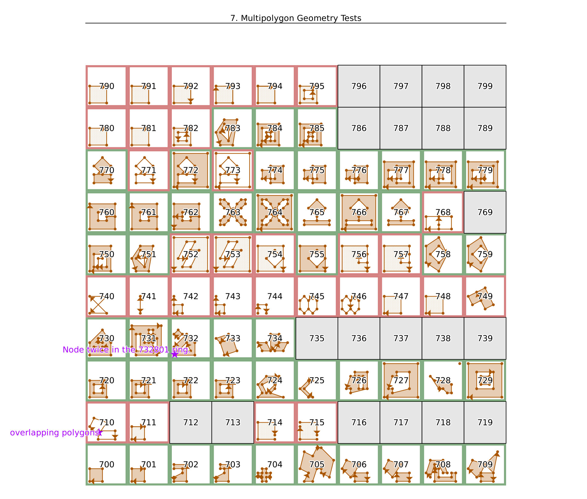

# Test Grid

This directory contains syntactically valid OSM data files with semantically
valid and invalid objects. It can be used to test any OSM software.

## Organization of the Test Files

All test data is in the `data` directory. In it you'll find subdirectories for
different categories of tests. Below them there is a numbered directory for each
test.

Test data from different tests uses different ID spaces and distinct geographic
areas. So when tests are used together their data must never interfere with
each other.

## Test Categories

Currently there are the following test categories, more will be added in the
future.

* 1 - Basic Geometry Tests
* 3 - Attribute Tests
* 7 - Multipolygon Geometry Tests
* 9 - Multipolygon Roles/Tags Tests. Some of these test contain old-style
      multipolygons. They will fail against newer code that doesn't know
      about them.

## Test Cases

Each test case is in its own directory. It contains the following files:

* `data.osm` - the test data itself
* `test.json` - description and further data about the testcase
* `result` - contains either the word "valid" or "invalid" to signify
  whether the data in the file is valid, ie it must be parseable by any OSM
  software, or invalid, in which case the handling of the data is unspecified.
* `nodes.wkt` (optional) - geometry of all nodes in data.osm in WKT format
* `ways.wkt` (optional) - geometry of all ways in data.osm in WKT format
* `labels.wkt` (optional) - labels for documentation of test cases

## ID Space Used

OSM IDs in the tests are used as follows:

All IDs start with the three-digit test number, for instance 711 and end with
the three-digit object ID. Nodes are numbered from 000, ways from 800 and
relations from 900. So there are enough IDs in each test for 800 nodes, 100
ways, and 100 relations.

## Geometries

Node coordinates for all tests in one test category are always inside a
bounding box with one degree width and height. The position of the bounding box
is given by the test number.

Example: All tests numbered 7xx are inside the bounding box (7.0 1.0, 8.0 2.0).

Individual tests are inside those in a bounding box with 0.1 degree width and
height. They are arranged in a 10x10 square. So test 700 is in
(7.0 1.0, 7.1 1.1), 701 is in (7.1 1.0, 7.2 1.1), 710 is in (7.0 1.1, 7.1 1.2).

## The `test.json` File

Each test directory contains a `test.json` file which contains the metadata
describing the test. It always contains the unique `test_id` and a
`description` field which contains a human language description of the test.

For multipolygon tests (7xx and 9xx) this JSON file also contains an `area`
field with further details. Multipolygons are complex and often broken in OSM.
Any software working with OSM data can decide whether to be strict and only
work with properly formatted data, or it can work with with the existing data
and fix it as best as it can. Some test cases that have broken data, take this
into account and provide both, a description of the test results when
interpreting the test case strictly and one description describing the results
after some clever fixing of the data. These are the `default` case and the
`fix` or `location` case. You can find them in the `areas` section of the JSON
file. (The difference between the `fix` and the `location` case is that
`location` cases are easily fixable if the software compares node locations
instead of only node IDs.)

Each of those `default` and `fix` cases contains an array of objects describing
the areas that the test case will generate with the following information:

* `from_type` - The type of top-level object this areas was created from (`way`
  or `relation`)
* `from_id` - The ID of the object this area was created from.
* `wkt` - The geometry of the multipolygon in WKT format. You have to take
  into account that there are several possible WKT descriptions for
  geometrically identical geometries. So a simple text comparison with the
  results of your text run is not enough. This can also be the special word
  `INVALID` if a correct geometry can not be built.
* `tags` - The OSM tags the resulting area will have.

## WKT Files

Each test case can contain its nodes and ways in WKT format. To generate those
`nodes.wkt` and `ways.wkt` files, run `make create-wkt`. This will read the
`data.osm` files and create the WKT files. Note that the output may not be
correct so you should check those files!

## Label Nodes

Interesting points in the data can be labeled by adding an optional
`labels.wkt` file containing a point in WKT format and a label. Test software
is not required to read these, but they can be used when visualizing tests for
instance. Format example:

`POINT(1.2 4.3) This is an important point`

## Concatenated Test Files

For your convenience the `data` directory contains the files `all.osm` and
`tests.json` which are a concatenation of all the individual `data.osm` and
`test.json` files, respectively. Depending on your test setup, this might make
it easier to work with many (or all) tests at the same time.

If you change any of the tests or add new ones, you can re-create those files
by running `make data/all.osm` and `make data/tests.json`.

## Spatialite Database

A Spatialite file `grid.db` is provided that contains this grid for the existing
test cases, test title, labels from `labels.wkt` files and all nodes, ways, and
multipolygons from the `nodes.wkt`, `ways.wkt`, and `multipolygons.wkt` files,
respectively.

It can be re-created by calling `make grid`.

## QGIS Project File

A QGIS project file is provided at `tests.qgs`. It shows the data from `grid.db`.

## Creating Tests

Unfortunately there is no easy way to create tests with JOSM or other software.
You just don't have enough control over the contents of the data file unless
you write it by hand.

The easiest way is probably something like this:
* draw the test case on a piece of paper with grid lines
* number all nodes
* number all used grid lines on x and y axis
* create directory for new test
* copy over `data.osm` from another test, globally search-and-replace test id
* add/edit nodes, ways, relations as needed
* add `test.json`, `result`, and wkt files

## License

All files are released into the public domain.

