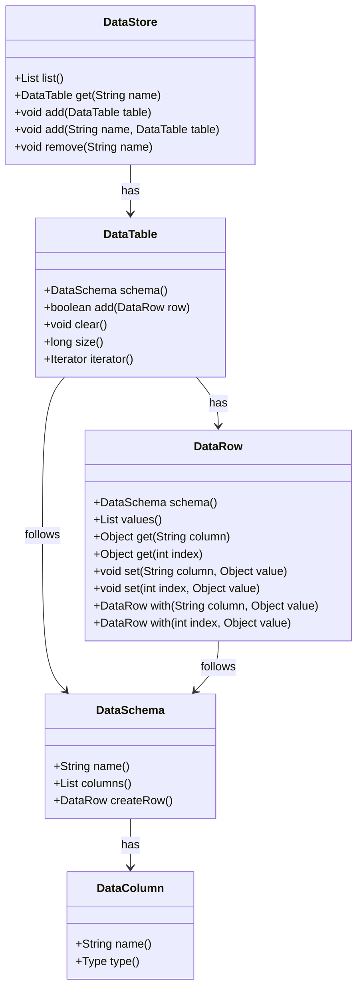

# Data Module

The data module contains classes and functions to load and process large data sets.

## On-heap, off-heap, and memory-mapped data

The following packages are used to deal with large data sets:
- `org.apache.baremaps.data.memory` contains utilities to deal with on-heap, off-heap, and memory-mapped memories that excapes the garbage collector.
- `org.apache.baremaps.data.type` contains classes to serialize and deserialize data types in memories.
- `org.apache.baremaps.data.collection` defines large collections backed by memories that can hold more than `Integer.MAX_VALUE` elements.
- `org.apache.baremaps.data.algorithm` contains algorithms to process large collections.

## Data Storage

A common issue is to deal with large data sets whose structure is discovered at runtime.
The `org.apache.baremaps.data.storage` package contains classes to deal with this kind of data.
The following diagram describes the main interfaces and classes of this package.

## Executing SQL queries in the JVM

The `org.apache.baremaps.data.calcite` package contains classes to execute SQL queries in the JVM.
This is a work in progress that demonstrates how to use the spatial extension of Apache Calcite in Apache Baremaps.
The long term goal is to perform very fast data processing without the need of a database.

