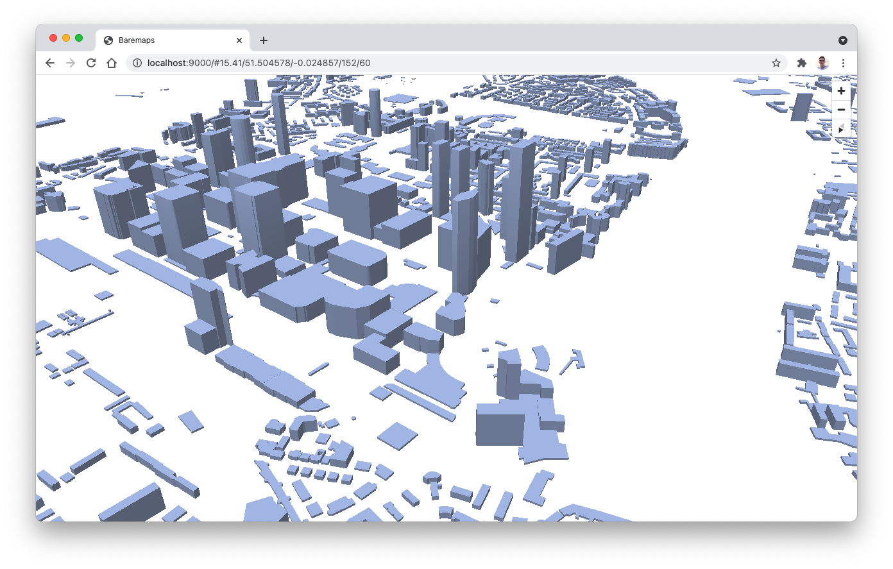

# Extrusion Example

This example builds upon the [OpenStreetMap example](https://www.baremaps.com/examples/openstreetmap/) and shows how 3d buildings can be extruded with Maplibre. 
First, start by downloading the OSM data for London in the current directory.

To begin with the tutorial, prepare the database by executing the following command.

```shell
baremaps execute \
  --database 'jdbc:postgresql://localhost:5432/baremaps?&user=baremaps&password=baremaps' \
  --file 'res://osm_create_extensions.sql' \
  --file 'res://osm_drop_tables.sql' \
  --file 'res://osm_create_tables.sql' \
  --file 'res://osm_create_gist_indexes.sql' \
  --file 'res://osm_create_gin_indexes.sql'
```

To import London data in the database.

```shell
baremaps import \
  --database 'jdbc:postgresql://localhost:5432/baremaps?&user=baremaps&password=baremaps' \
  --file 'https://download.geofabrik.de/europe/great-britain/england/greater-london-latest.osm.pbf' \
  --enable-http
```

In the [tileset.json](https://raw.githubusercontent.com/baremaps/baremaps/main/docs/examples/extrusion/tileset.json) file, notice the SQL query associated with the building layer. 
Here, the number of levels stored in OSM is multiplied by 3, which rawly corresponds to the height of a level in meters.

```sql
SELECT 
    id, 
    tags || hstore(
        'building:height'::text, 
        ((CASE WHEN tags -> 'building:levels' ~ '^[0-9\.]+$' 
            THEN tags -> 'building:levels' 
            ELSE '1' END)::real * 3)::text), 
    geom 
FROM osm_ways 
WHERE tags ? 'building'
```

This property is then used in the [style.json](https://raw.githubusercontent.com/baremaps/baremaps/main/docs/examples/extrusion/style.json) file to extrude the buildings. 

```json
{
  ...
  "layers" : [ {
    "id" : "building",
    "type" : "fill-extrusion",
    "source" : "baremaps",
    "source-layer" : "building",
    "paint" : {
      "fill-extrusion-color" : "rgb(152, 174, 221)",
      "fill-extrusion-height": ["get", "building:height"],
      "fill-extrusion-base": 0,
      "fill-extrusion-opacity": 0.9
    }
  } ],
  ...
}
```


To preview this example, start the tile viewer. Here, the cache directive is a [caffeine specification](https://www.javadoc.io/doc/com.github.ben-manes.caffeine/caffeine/2.2.2/com/github/benmanes/caffeine/cache/CaffeineSpec.html) for a 100MB tile cache.

```shell
baremaps view \
  --database 'jdbc:postgresql://localhost:5432/baremaps?user=baremaps&password=baremaps' \
  --tileset 'tileset.json' \
  --style 'style.json' \
  --cache 'maximumWeight=100000000'
```

Well done, a map of London with extruded buildings should now appear in your [browser](http://localhost:9000/)!




