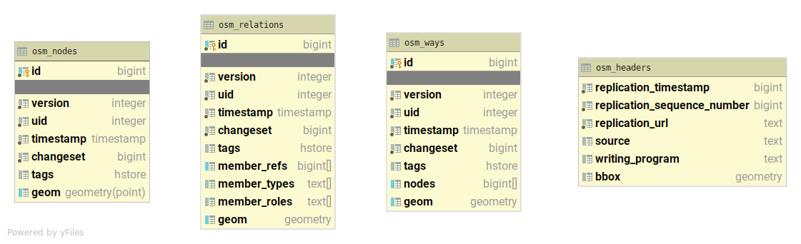
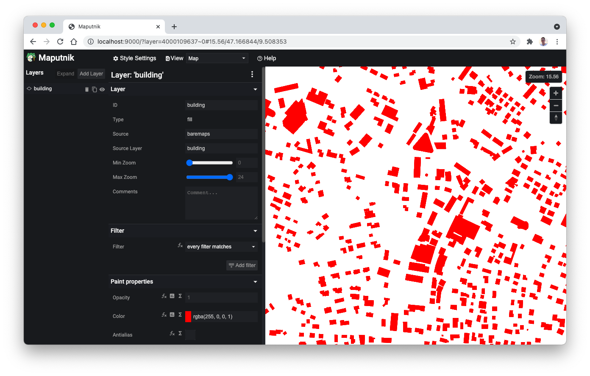

# OpenStreetMap Example

Baremaps is aimed at being the most productive toolkit for creating custom vector tiles from OpenStreetMap data.

In this tutorial, we'll learn how to use Baremaps to import OpenStreetMap data in a Postgis database and how to create vector tiles from this data.
Notice that the following steps assume that Baremaps and Postgis are [installed](https://www.baremaps.com/installation/).
Also, if you are in a hurry, consider skipping the "Under the Hood" sections.

## Dataset

OpenStreetMap (OSM) is a free and editable map of the world.
It is maintained by a community of passionate volunteers in a way which is similar to Wikipedia.
Every week, OpenStreetMap publishes a [full dump](https://planet.openstreetmap.org/) of its data in two flavours: a large XML file of about 90GB and a more compact binary file of about 50GB in the  [Protocol Buffer Format](https://developers.google.com/protocol-buffers) (PBF).
As processing such large files can take several hours, [Geofabrik](http://www.geofabrik.de/data/download.html) regularly publishes smaller extracts of OSM for specific regions.
In this example we will use a tiny extract of OSM for [Liechtenstein](https://en.wikipedia.org/wiki/Liechtenstein), which is suitable for fast experiments.

## Importing OpenStreetMap Data

To begin with the tutorial, prepare the database by executing the following command.
Hereafter, the command executes resources (`res://`) located in the Java classpath sequentially, but the queries they contain are executed in parallel.

```
baremaps execute \
  --database 'jdbc:postgresql://localhost:5432/baremaps?&user=baremaps&password=baremaps' \
  --file 'res://osm_create_extensions.sql' \
  --file 'res://osm_drop_tables.sql' \
  --file 'res://osm_create_tables.sql' \
  --file 'res://osm_create_gist_indexes.sql' \
  --file 'res://osm_create_gin_indexes.sql'
```

To import the sample OSM data (`liechtenstein-latest.osm.pbf`) in Postgis with Baremaps, execute the following command in a terminal.

```
baremaps import \
  --database 'jdbc:postgresql://localhost:5432/baremaps?&user=baremaps&password=baremaps' \
  --file 'https://download.geofabrik.de/europe/liechtenstein-latest.osm.pbf' \
  --enable-http
```

Depending on the size of the PBF file, the execution of this command may take some time.
Eventually, the output produced by the command should look as follows.

```
[INFO ] 2021-09-19 11:43:59.902 [main] HikariDataSource - HikariPool-1 - Starting...
[INFO ] 2021-09-19 11:44:00.036 [main] HikariPool - HikariPool-1 - Added connection org.postgresql.jdbc.PgConnection@5c48c0c0
[INFO ] 2021-09-19 11:44:00.038 [main] HikariDataSource - HikariPool-1 - Start completed.
[INFO ] 2021-09-19 11:44:00.591 [main] Import - Importing data
[INFO ] 2021-09-19 11:44:06.460 [main] Import - Done
```

### Under the Hood (Optional)

What can we learn from this output?
First, we notice that Baremaps uses a connection pool to parallelize the import procedure.
Then it imports the OSM data, populating the tables previously created.
In our case, the input is a remote file hosted by Geofabrik, however it could also be an local file or an S3 url.

OSM's [conceptual model](https://wiki.openstreetmap.org/wiki/Elements) builds upon the notions of nodes, ways and relations.
In this normalized data model, a line (or way) is formed by a sequence of points (nodes) referenced by their id.
In order to save denormalized geometries in Postgis (e.g. linestring, polygon, multi-polygon, etc.), Baremaps creates a cache for nodes, ways and relations.
[LMDB](https://symas.com/lmdb/) is used under the hood to achieve great performance.

After the creation of the cache, Baremaps can populate the database with geometries.
The geometries are stored in three tables named after the OSM conceptual model: `osm_nodes`, `osm_ways`, and `osm_relations`.
In order to improve performances at query time, Baremaps also creates indexes for the tags and the geometries.
The following Figure displays the schema of the Postgis database created by Baremaps.



## Creating Vector Tiles

In order to create vector tiles, Baremaps uses JSON configuration files.
You can obtain a copy of the [tileset.json](https://raw.githubusercontent.com/baremaps/baremaps/main/docs/examples/openstreetmap/tileset.json) and [style.json](https://raw.githubusercontent.com/baremaps/baremaps/main/docs/examples/openstreetmap/style.json) file in the repository.
The [tileset.json](https://raw.githubusercontent.com/baremaps/baremaps/main/docs/examples/openstreetmap/tileset.json) is loosely based on the [TileJSON](https://github.com/mapbox/tilejson-spec) specification. 
It defines general tileset properties and lists layers containing SQL queries to be executed by Postgis.
The [style.json](https://raw.githubusercontent.com/baremaps/baremaps/main/docs/examples/openstreetmap/style.json) file is a [Maplibre Style](https://maplibre.org/maplibre-gl-js-docs/api/).
It defines general style and rendering properties. 

Let's preview and edit the map with the sample configuration files by executing the following command in a terminal.

```
baremaps edit \
  --database 'jdbc:postgresql://localhost:5432/baremaps?user=baremaps&password=baremaps' \
  --tileset 'tileset.json' \
  --style 'style.json'
```

Well done, a local tile server should have started and you can open a map of Liechtenstein in your browser ([http://localhost:9000/](http://localhost:9000/))!
Baremaps dynamically generates a blueprint [Mapbox Style](https://docs.mapbox.com/mapbox-gl-js/style-spec/) from the json configuration file.
It is aimed at quickly previsualizing the data and provides a foundation for creating more complex styles.
Notice that the changes in the configuration files are automatically reloaded by the browser.



### Under the Hood (Optional)

Baremaps extensively rely on the fantastic [ST_AsMVT](https://postgis.net/docs/ST_AsMVT.html) functions released by the Postgis team to produce [Mapbox Vector Tiles](https://docs.mapbox.com/vector-tiles/specification/).
However, in the following excerpt of the json configuration file, none of these concepts appear in the SQL queries.

```json
{
  ...
  "vector_layers": [
    {
      "id": "aeroway",
      "queries": [
        {
          "minzoom": 12,
          "maxzoom": 20,
          "sql": "SELECT id, tags, geom FROM osm_nodes WHERE tags ? 'aeroway'"
        },
        ...
      ]
    },
  ],
  ...
}
```

Why don't we see these function calls in the configuration?
Baremaps wants you to focus on the content of the tiles, and relieves you from the burden of writing complex SQL queries.
In fact, at runtime, Baremaps merges all the queries of the configuration file into a single optimized query that produces vector tiles.

In production, vector tiles are rarely served dynamically. Why is that so?
First, a large blob store is much cheaper than a relational database to [operate](https://wiki.c2.com/?StorageIsCheap).
Second, content delivery networks (CDNs) greatly improve web performances by caching static content close to the end user.
Baremaps has been conceived with these lasting trends in mind.
The following command produces a local directory containing precomputed static tiles.
These tiles can be served with Apache, Nginx, or Caddy, but also copied in a blob store behind a content delivery network, such as Cloudflare, Stackpath, or Fastly.

```
baremaps export \
  --database 'jdbc:postgresql://localhost:5432/baremaps?user=baremaps&password=baremaps' \
  --tileset 'tileset.json' \
  --repository 'tiles/'
```

Notice that Baremaps has the ability to publish tiles directly on AWS.
To do so, install the [AWS Command Line Interface](https://aws.amazon.com/cli/) on your computer and run the `aws configure` command in the terminal.
Then, add the `--enable-aws` flag to the previous command and replace the `tiles/` directory with an S3 URL, Baremaps will take care of the rest.


## Conclusion

In this tutorial, we learnt how to import OpenStreetMap data in Postgis and how to create vector tiles with Baremaps.
Prior to the release of Baremaps, we believe that creating a pipeline for publishing vector tiles from OpenStreetMap data was a rather time consuming task.
As shown in this demonstration, Baremaps literally brings back the fun to creating a web mapping pipeline!
