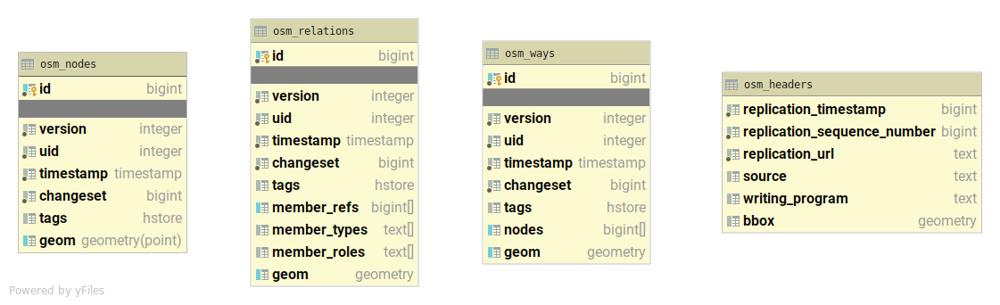

# OpenStreetMap Example

Baremaps is aimed at being the most productive toolkit for publishing custom vector tiles from OpenStreetMap data. 

In this tutorial, we'll learn how to use Baremaps to import OpenStreetMap data in a Postgis database and how to publish vector tiles from this data.
Notice that the following steps assume that Baremaps and Postgis are [installed](../../README.md).
Also, if you are in a hurry, consider skipping the "under the hood" sections.

## Dataset

OpenStreetMap (OSM) is a free and editable map of the world. 
Similarly to Wikipedia, it is maintained by a community of passionate volunteers.
Every week, OpenStreetMap publishes a [full dump](https://planet.openstreetmap.org/) of its data in two flavours: a large XML file (about 90GB) and a more compact binary file (about 50GB) in the  [Protocol Buffer Format](https://developers.google.com/protocol-buffers) (PBF).
As processing such large files can takes several hours, [Geofabrik](http://www.geofabrik.de/data/download.html) regularly publishes smaller extracts of OSM for specific regions.
The current directory contains a tiny extract of OSM for [Liechtenstein](https://en.wikipedia.org/wiki/Liechtenstein), which is suitable for experiments.

## Importing OpenStreetMap Data

To import the sample OSM data (`liechtenstein-latest.osm.pbf`) in Postgis with Baremaps, execute the following command in a terminal.

```
baremaps import \
  --input 'liechtenstein-latest.osm.pbf' \
  --database 'jdbc:postgresql://localhost:5432/baremaps?allowMultiQueries=true&user=baremaps&password=baremaps'
```

Depending on the size of the import, the execution of this command may take some time.
Eventually, the output produced by the command should be as follow.

```
[INFO ] 2020-05-14 21:01:13.958 [main] Import - 8 processors available.
[INFO ] 2020-05-14 21:01:13.972 [main] Import - Dropping tables.
[INFO ] 2020-05-14 21:01:14.170 [main] Import - Creating tables.
[INFO ] 2020-05-14 21:01:14.197 [main] Import - Creating primary keys.
[INFO ] 2020-05-14 21:01:14.443 [main] Import - Fetching input.
[INFO ] 2020-05-14 21:01:14.444 [main] Import - Populating cache.
[INFO ] 2020-05-14 21:01:15.731 [main] Import - Populating database.
[INFO ] 2020-05-14 21:01:17.400 [main] Import - Indexing geometries.
[INFO ] 2020-05-14 21:01:22.293 [main] Import - Indexing attributes.
```

### Under the Hood

Here, we notice that Baremaps identifies the number of processor available to parallelize the import procedure.
Then it creates the database, the primary keys and fetches the input.
In our case, the input is a local file, however it could also be an HTTP or S3 url.

OSM's [conceptual model](https://wiki.openstreetmap.org/wiki/Elements) build upon the notions of nodes, ways and relations.
Therefore, baremaps need to build a cache in order to recreate geometries.
[LMDB](https://symas.com/lmdb/) is used under the hood to achieve great performances.

After the creation of the cache, Baremaps can populate the database with geometries.
The geometries are stored in three tables named after the OSM's conceptual model: `osm_nodes`, `osm_ways`, and `osm_relations`.
In order to improve performances at query time, Baremaps creates indexes for the tags and the geometries.
The following Figure, shows the schema of the Postgis database created by Baremaps.



## Publishing Vector Tiles

In order to create vector tiles, Baremaps uses a YAML configuration file.
This file defines general properties, a list of layers containing SQL queries to be executed against Postgis.

Let's preview the data with the sample configuration file (`config.yaml`) by executing the following command in a terminal.

```
baremaps serve \
  --database 'jdbc:postgresql://localhost:5432/baremaps?allowMultiQueries=true&user=baremaps&password=baremaps' \
  --config 'config.yaml' \
  --watch-changes
```

Well done, a local tile server should have started and a map of liechtenstein should appear in your browser ([http://localhost:9000/](http://localhost:9000/))!
Baremaps dynamically generates a [Mapbox Style](https://docs.mapbox.com/mapbox-gl-js/style-spec/) from the YAML configuration file aimed at previsualizing the data. 
Here, notice the flag `--watch-changes`, it enables the browser to reload whenever the configuration file changes, which greatly accelerates the process of composing vector tiles.


### Under the Hood

Baremaps extensively rely on the fantastic [ST_AsMVT](https://postgis.net/docs/ST_AsMVT.html) functions released by the Postgis team to produce [Mapbox Vector Tiles](https://docs.mapbox.com/vector-tiles/specification/).
However, notice that in the following excerpt of the YAML configuration file, none of these concepts appear in the SQL queries.

```yaml
id: 'openstreetmap'
...
layers:
  - id: 'aeroway'
    type: 'geometry'
    minZoom: 12
    maxZoom: 20
    queries:
      - SELECT id, tags, geom FROM osm_nodes WHERE tags ? 'aeroway'
      - SELECT id, tags, geom FROM osm_ways WHERE tags ? 'aeroway'
      - SELECT id, tags, geom FROM osm_relations WHERE tags ? 'aeroway' AND tags -> 'type' = 'multipolygon'
...
```

Why don't we see these function calls in the configuration?
Baremaps wants you to focus on the content of the tiles, and relieves from the burden of writing complex queries.
In fact, at runtime, Baremaps rewrites merges all the queries into a single optimized query that selects the data corresponding to a tile and transforms it into a vector tile.

In production, vector tiles are rarely served dynamically. Why is it so?
First, a blob store is much cheaper than a relational database.
Second, content delivery networks (CDNs) greatly improve web performances by caching static content close to the end user.
Baremaps has been conceived with this emerging trend in mind.
The following command produces a local directory containing precomputed static tiles.
These tiles can be served with apache, nginx, or caddy, but also copied in a blob store behind a content delivery network.

```
baremaps export \
  --database 'jdbc:postgresql://localhost:5432/baremaps?allowMultiQueries=true&user=baremaps&password=baremaps' \
  --config 'config.yaml' \
  --repository 'tiles/'
```

Notice, that Baremaps has the ability to publish tiles directly on AWS.
To do so, install the [AWS Command Line Interface](https://aws.amazon.com/cli/) on your computer and run the `aws configure` command in the terminal.
Then, simply add the `--enable-aws` flag to the command and replace the `tiles/` directory with an S3 URL, Baremaps will do the rest.


## Conclusion

In this tutorial, we learnt how to import OpenStreetMap data in Postgis and how to publish vector tiles with Baremaps.
Prior to the release of Baremaps, we believe that creating a pipeline for publishing vector tiles from OpenStreetMap data was a rather time consuming task.

As shown in this demonstration, Baremaps literally brings back the fun to creating a web mapping pipeline!
Nuts and bolts still need to be tightened, but give it a try and share your impressions, it is [open-source](../../LICENSE) software.


